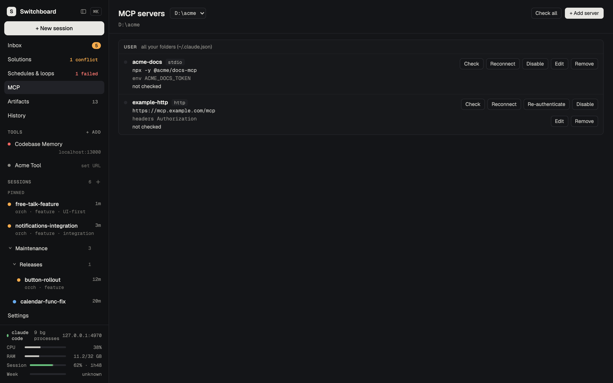
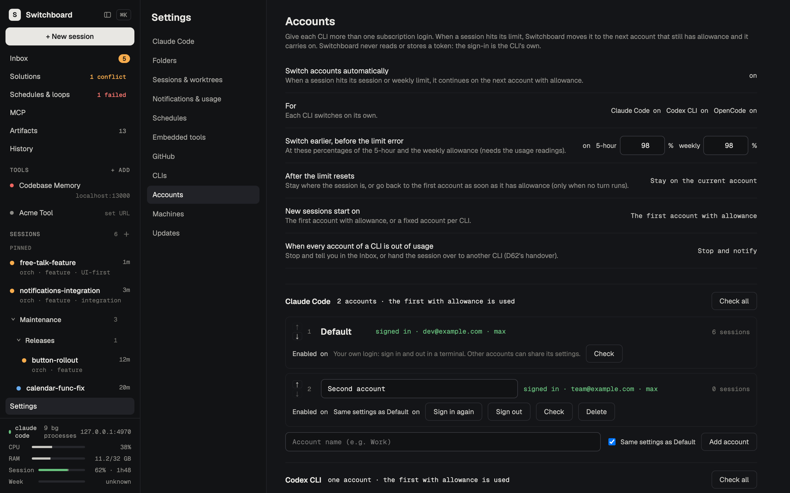

# Switchboard

[](https://m8ven.ai/mcp/marcingadomski94/switchboard?s=readme)

<a href="https://www.paypal.com/donate/?hosted_button_id=S9P6C8KLXWRZN" target="_blank" rel="noopener noreferrer"></a>

Switchboard is a local web app for running many coding-agent sessions at once: **Claude Code**, **Codex CLI** and **OpenCode**. From one window you can:

- start sessions in any folder, workspace or repo, each in its own git worktree if you want;
- watch every agent work live, subagents and workflow agents included;
- answer their questions and permission prompts from a single Inbox;
- paste screenshots and files into the chat;
- switch a session to another CLI or another account mid-way, automatically when a usage limit is hit;
- manage MCP servers, schedules and loops;
- connect Switchboards on several machines over Tailscale and drive their sessions from one place;
- move sessions between Switchboard and a terminal, and back.

It runs on your machine only (`127.0.0.1`). It drives the unmodified CLIs with your own logins, and updates itself from GitHub releases.


- [Requirements](#requirements)
- [Install and run](#install-and-run)
- [Updating](#updating)
- [Start at login](#start-at-login)
- [Configuration](#configuration)
- [Features](#features)
- [Security model](#security-model)
- [For developers](#for-developers)
- [Troubleshooting](#troubleshooting)

---

## Requirements

Install these **before** Switchboard:

| What | Needed for | Check |
|---|---|---|
| **Node.js 24 or newer** (with npm), on `PATH` | Switchboard runs its TypeScript directly on Node (type stripping). | `node --version` → `v24.x` or higher |
| **git** | Worktrees, branches and diffs. On Windows, Git for Windows is also what Claude Code needs. | `git --version` |
| **Claude Code CLI** (`claude`), signed in with your **claude.ai subscription** (Pro / Max) | Every session is a real `claude` process. An API key alone is not enough for Remote Control. | `claude --version`, `claude auth status` |
| **A browser**: Chrome (recommended), Edge, Firefox or Safari | The UI. Embedding signed-in sites such as Jira needs Chrome ([Embedded tools](#embedded-tools)). | |
| **Codex CLI** (`codex`) and / or **OpenCode** (`opencode`), signed in (optional) | Sessions on those CLIs instead of Claude Code ([CLIs](#clis)). Without them, they just can't be chosen. | `codex --version`, `codex login status`; `opencode --version`, `opencode auth list` |
| **GitHub CLI** (`gh`), signed in (optional) | Detects merged pull requests of session worktrees. | `gh auth status` |
| **Tailscale** (optional) | Connecting Switchboards on several machines ([Machines (peers)](#machines-peers)). | `tailscale status` |

<details>
<summary><b>macOS</b>: installing the requirements</summary>

```sh
# Homebrew: https://brew.sh
brew install node git          # check `node --version` is 24 or newer (or use nvm / fnm)
brew install gh                # optional
curl -fsSL https://claude.ai/install.sh | bash   # Claude Code (native installer)
claude                         # run once and sign in with your claude.ai account
```
</details>

<details>
<summary><b>Linux</b>: installing the requirements</summary>

```sh
# Node.js 24 via nvm (https://github.com/nvm-sh/nvm); distro packages are often older
curl -o- https://raw.githubusercontent.com/nvm-sh/nvm/master/install.sh | bash
exec $SHELL -l && nvm install 24
sudo apt install git           # Debian / Ubuntu; use your distro's package manager otherwise
# optional: gh (https://github.com/cli/cli/blob/trunk/docs/install_linux.md)
curl -fsSL https://claude.ai/install.sh | bash   # Claude Code (native installer)
claude                         # run once and sign in with your claude.ai account
```

Start at login uses a **systemd user service** (most desktop distributions).
</details>

<details>
<summary><b>Windows 10 / 11</b>: installing the requirements</summary>

In **PowerShell**:

```powershell
winget install OpenJS.NodeJS.LTS   # then check `node --version` is 24 or newer
winget install Git.Git             # Git for Windows (Claude Code needs it too)
winget install GitHub.cli          # optional
irm https://claude.ai/install.ps1 | iex   # Claude Code (native installer: claude.exe)
claude                             # run once and sign in with your claude.ai account
```

Open a **new** terminal afterwards so the updated `PATH` is picked up. Use the native installer for Claude Code: an npm install creates `claude.cmd`, which Switchboard can't start without a shell (then set `SWITCHBOARD_CLAUDE_BIN`, see [Configuration](#configuration)). `tar` and `curl` come with Windows 10 and 11.
</details>

## Install and run

The recommended way is a **release**: the UI comes pre-built, and Switchboard [updates itself](#updating). Pick a folder for it. The examples use `~/Applications/Switchboard` (macOS), `~/.local/opt/switchboard` (Linux) and `%LOCALAPPDATA%\Programs\Switchboard` (Windows). Replace `1.12.0` with the [latest release](https://github.com/MarcinGadomski94/switchboard/releases/latest).

### macOS and Linux

```sh
V=1.12.0
DIR=~/Applications/Switchboard            # Linux: ~/.local/opt/switchboard
mkdir -p "$DIR" && cd "$DIR"
curl -LO https://github.com/MarcinGadomski94/switchboard/releases/download/v$V/switchboard-$V.tar.gz
curl -LO https://github.com/MarcinGadomski94/switchboard/releases/download/v$V/switchboard-$V.tar.gz.sha256
shasum -a 256 -c switchboard-$V.tar.gz.sha256   # Linux: sha256sum -c …
tar -xzf switchboard-$V.tar.gz && cd switchboard-$V
npm ci --omit=dev                         # runtime dependencies only
npm run service:install -- --start        # start now and at every sign-in (launchd / systemd --user)
```

Prefer not to install a service? Run `npm start` in that folder instead, and keep the terminal open.

### Windows

In **PowerShell**:

```powershell
$V = "1.12.0"
$Dir = "$env:LOCALAPPDATA\Programs\Switchboard"
New-Item -ItemType Directory -Force $Dir | Out-Null; Set-Location $Dir
curl.exe -LO "https://github.com/MarcinGadomski94/switchboard/releases/download/v$V/switchboard-$V.tar.gz"
curl.exe -LO "https://github.com/MarcinGadomski94/switchboard/releases/download/v$V/switchboard-$V.tar.gz.sha256"
# the two hashes must be the same:
(Get-FileHash "switchboard-$V.tar.gz" -Algorithm SHA256).Hash.ToLower(); (Get-Content "switchboard-$V.tar.gz.sha256").Split(" ")[0]
tar -xzf "switchboard-$V.tar.gz"; Set-Location "switchboard-$V"
npm ci --omit=dev
npm run service:install -- --start    # a Task Scheduler task that starts Switchboard at every sign-in
```

The task runs `node.exe` in a console window; **closing that window stops Switchboard** (minimise it instead). Or run `npm start` in that folder by hand.

### Open it

Open **http://127.0.0.1:13001** by typing it or from a bookmark. That first page load gives your browser its access cookie ([Security model](#security-model)).

The first time, a **setup wizard** opens:
1. It checks the `claude` CLI and its sign-in (plus `gh`).
2. It adds your first **folder**: a workspace (a folder with a router `AGENTS.md`) or a git repository.
3. It scans that folder's solutions.
4. It sets up notifications.
5. It shows the usage-warning threshold (changed in Settings → Notifications & usage).

You can skip it and do all of this later in Settings. Your data (the database, the access token, attachments, logs, updated versions) lives in the per-user data folder: `~/Library/Application Support/Switchboard` (macOS), `~/.local/share/switchboard` (Linux), `%LOCALAPPDATA%\Switchboard` (Windows).

### From source (development)

A git checkout builds the UI itself and is only **told** about new releases, not updated:

```sh
git clone https://github.com/MarcinGadomski94/switchboard.git && cd switchboard
npm ci          # exact, pinned dependencies (including the build tools)
npm run build   # builds the UI into dist/web
npm start       # serves http://127.0.0.1:13001
```

Run it on another port next to a release install with `SWITCHBOARD_PORT=13005 npm start` (PowerShell: `$env:SWITCHBOARD_PORT=13005; npm start`).

## Updating

Switchboard checks its [GitHub releases](https://github.com/MarcinGadomski94/switchboard/releases) on start and every hour (Settings → **Updates** → **Check for updates** checks now). A newer release shows a banner and an Inbox item; **What's new** shows its release notes.

**A release install** (unpacked from a `switchboard-<version>.tar.gz`) updates itself: **Update** downloads the release, checks its SHA-256 checksum, unpacks it next to the running one (`<data folder>/versions/<version>`), runs `npm ci --omit=dev` there and switches to it. When Switchboard runs as the login service ([Start at login](#start-at-login)), the service restarts it into the new version and live sessions resume; started by hand with `npm start`, it tells you to restart it from the new folder (`cd "<data folder>/versions/<version>" && npm start`). Your database and settings stay where they are; migrations run on the new version's first start. The previous version stays for a rollback: `npm run service:install -- --start` in its folder. Details: [`docs/updates.md`](docs/updates.md).

**A git checkout** is only told about new releases (with the commands). After pulling new code:

```sh
npm ci           # only when package-lock.json changed
npm run build    # the UI is served from dist/web, so rebuild it
# then restart Switchboard (stop npm start / the service and start it again)
```

Database migrations run by themselves on start. Sessions that were live when Switchboard stopped are resumed after the restart. `SWITCHBOARD_UPDATES=off` switches the checks off.

**Making a release** (maintainers): bump the version (and add the `CHANGELOG.md` entry), commit, then `npm run release:package` writes `dist/release/switchboard-<version>.tar.gz` and its `.sha256`; publish both with `gh release create v<version> … --notes-file <notes>` ([`docs/updates.md`](docs/updates.md) → *Release packages*).

## Start at login

**Settings → Claude Code → Start at login**, or from a terminal:

```sh
npm run service:install -- --dry-run   # shows every file and command, changes nothing
npm run service:install                # launchd (macOS) / systemd --user (Linux) / Task Scheduler (Windows)
npm run service:uninstall
```

Run these in the folder you start Switchboard from: the service starts `node src/server/main.ts` there, with the `SWITCHBOARD_*` settings of the shell you install from (port, data folder and the CLI commands when they differ from the defaults). A release install is ready as it is; a git checkout needs `npm run build` first. `--start` also starts it right away. It starts Switchboard at sign-in and is not restarted after a crash (start it again with `npm run service:install -- --start`). Details: [`docs/service.md`](docs/service.md).

## Configuration

Settings are environment variables, read at start. An invalid value makes `npm start` exit with a message.

| Variable | Default | What |
|---|---|---|
| `SWITCHBOARD_PORT` | `13001` | The port; the address is always `127.0.0.1`. |
| `SWITCHBOARD_DATA_DIR` | per-user app data (`~/Library/Application Support/Switchboard` on macOS) | The database (`switchboard.db`) and the access token (`sb_token`). |
| `SWITCHBOARD_CLAUDE_BIN` | `claude` | The Claude Code CLI; a JSON array is used as an argv prefix. |
| `SWITCHBOARD_CODEX_BIN` | `codex` | The Codex CLI (optional); Settings → CLIs can override it. |
| `SWITCHBOARD_OPENCODE_BIN` | `opencode` | OpenCode (optional); Settings → CLIs can override it. |
| `SWITCHBOARD_GH_BIN` | `gh` | The GitHub CLI. |
| `SWITCHBOARD_SETUP_WIZARD` | on | `off` stops the wizard from opening by itself. |
| `SWITCHBOARD_UPDATES` | on | `off` stops the hourly check for new releases (and updating). |
| `SWITCHBOARD_UPDATE_REPO` | `MarcinGadomski94/switchboard` | The GitHub repository whose releases are checked (forks). |
| `SWITCHBOARD_NPM_BIN` | npm next to `node` | The npm that runs `npm ci --omit=dev` when updating a release install. |
| `SWITCHBOARD_CLAUDE_EXTRA_ARGS` | none | Dev only: a JSON array of extra flags for every `claude` spawn. |
| `SWITCHBOARD_TAILSCALE_BIN` | `tailscale` | The Tailscale CLI; `tailscale ip -4` gives the address of the optional peer listener (Machines). |

Everything else, such as saved folders, tools, notification and usage settings, lives in the database and is edited in **Settings**. The full list, with the peer-timing, development and test-only variables, is in [`docs/configuration.md`](docs/configuration.md).

---

## Features

<table>
  <tr>
    <td width="50%"><br><sub>New session: the Simple form (Full adds solutions, worktrees and epic/task branching)</sub></td>
    <td width="50%"><br><sub>Inbox: every agent question in one place</sub></td>
  </tr>
  <tr>
    <td width="50%"><br><sub>Schedules &amp; loops</sub></td>
    <td width="50%"><br><sub>Solutions, and a sidebar with pins, folders and subfolders</sub></td>
  </tr>
  <tr>
    <td width="50%"><br><sub>MCP servers: check, reconnect, sign in, add and edit</sub></td>
    <td width="50%"><br><sub>Settings → Accounts: several logins per CLI, switched on usage limits</sub></td>
  </tr>
  <tr>
    <td width="50%"><br><sub>Settings → Machines: pair other Switchboards on your tailnet</sub></td>
    <td width="50%"></td>
  </tr>
</table>

Screenshots come from the demo seed (`docs/demo.md`); `npm run screenshots` retakes them.

### Folders
There is no single workspace root. You save **folders** in **Settings → Folders**, and each session, scan and schedule names the one it works in:
- A **workspace** (router `AGENTS.md`) gets the router's session-start questions answered up front in the Full New-session form (the Simple form leaves them to the agent).
- A **git repo** is a single solution.
- Any other folder (no `AGENTS.md`, not a git repo) can be saved too, for **Simple** sessions.

A folder can have a custom name. [`docs/folders.md`](docs/folders.md)

### CLIs
Every session runs on **Claude Code**, **Codex CLI** or **OpenCode**:
- **Settings → CLIs:** each CLI's command (`SWITCHBOARD_CODEX_BIN` / `SWITCHBOARD_OPENCODE_BIN` or set on the page), version, sign-in and models; a CLI that is not installed or signed out says so, with the install steps, and simply can't be chosen.
- **Per session:** the New-session forms have a **CLI** row (default: the sidebar's default CLI); the model picker shows that CLI's models.
- **Switch mid-session:** the session header's CLI switcher hands the session over in the same chat and folder. The current agent writes a handover first; if it can't (out of usage, not runnable), the incoming CLI reads the chat history itself. The chat shows a divider ("Switched from Claude Code to Codex CLI · handover by …").
- **Sidebar:** the footer's CLI label sets the default CLI for new sessions and offers **Switch running sessions…** for all live sessions at once; session rows show a small CLI badge.
- **The same features where the CLI has them:** chat and tool steps, images, permission requests and questions in the Inbox (with the CLI's own "always"), Stop, pause / resume, model and effort, the context meter, Codex's usage limits in the footer, subagents, History moves (on request), the MCP page (Codex: add / remove), schedules, peers. Claude Code-only features (Remote Control, teleport, Workflow agents, background tasks, hooked terminal sessions) stay visible and say why they are not available.

### Standing instruction for agents
**Settings → Sessions & worktrees → Standing instruction for agents:** one short instruction given to the agent of every session, on every CLI. It is on by default and asks agents to write out any proposal, table, list, plan or comparison before asking about it, and never to refer to content "above" that they did not write. Edit the text, switch it off, or **Reset to default**; a change applies to sessions started or resumed afterwards. Sessions you run yourself in a terminal are not affected. [`docs/settings.md`](docs/settings.md)

### Accounts
Each CLI can have more than one subscription login. **Settings → Accounts** lists them per CLI in priority order (**Default** is your own login; every account, Default included, can be renamed), signs them in and out (the CLI's own login: the page opens in a new tab, with a copyable terminal command as the fallback and a paste-back for a paired machine's), and holds the rules: switch automatically when a session hits its session or weekly limit (or earlier at a percentage), switch back after a reset or stay, which account new sessions start on, and what to do when every account is spent (notify, or hand over to another CLI). A session moves to the next account that has allowance, in the same chat and folder (its conversation is copied to that account), with a divider in the chat; the New-session forms and the session header show the account, **Switch account** and a **pin** stop or steer it, and the footer shows each account's usage. Switchboard never reads or stores a token. [`docs/accounts.md`](docs/accounts.md)

Neither Codex nor OpenCode was run while this was built: their protocols come from their source, pinned in [`docs/providers.md`](docs/providers.md); [`docs/spike-providers.md`](docs/spike-providers.md) lists the checks to run once they are installed.

### New session
- **Simple / Full:** a switch at the top of the dialog. **Simple** (the default) starts in any folder (a workspace, a git repo or any plain folder) and asks only for the folder, the message, an optional title (taken from the message when empty), the model and whether to work in its own git worktree (git repo folders; the branch is derived from the title, e.g. `sb/fix-login`, and can be edited). **Full** is the form below. The dialog remembers the last one used, and what you typed carries over when you switch.
- **Title:** free text, e.g. "JIRA Ticket handling". A kebab-case short name is derived from it for the branch and worktree folder.
- **Task:** what the agent should do.
- **Session-start answers:** work type, mode, solutions in scope, phase, mobile coordination, ultracode.
- **No solutions picked:** you can leave the solutions empty and let the agent decide. It creates the worktrees it needs, Switchboard adopts them, and the session's solutions fill in from what the agent touches.
- **Model and effort:** chosen in the form; the next session starts on your last choice.
- **Worktrees:** each session can work in its own git worktree. The **branch must be named after its ticket**, e.g. `PROJ-0001-short-description`, and it is pre-filled when the title starts with a ticket key.
- **Continuing existing work:**
  - **pick a terminal conversation** to move it into Switchboard;
  - **"From a remote session"**: paste a claude.ai/code session URL to continue a cloud or Remote Control session as a local copy.
- **Branching:** with an epic (key + summary), task branches are cut from `feature/<EPIC-KEY>-<Summary>`, which is itself cut from `origin/dev`. Without an epic (bug fixes), they are cut from `origin/master` after a fetch. Branches are created and pushed lazily, only in the repos the agent changes. A preflight table shows, per repo, the base, the epic, the task branch, the cut point and the PR target before you start. An existing task branch is reused.
- **Stacked tasks:** type a **Parent** (a task key such as `PROJ-3013`, or a branch name; it is pre-filled when the task says "create it from PROJ-3013") to cut the task from that unmerged task branch instead of the epic, per repo where the parent exists, with its PR into the parent. The preflight shows each repo's resolved base, PR target and the parent PR's status. When the parent PR merges, the Inbox tells you and the agent is asked to retarget its PR and rebase (it asks you before force-pushing); a parent closed without merging raises an Inbox item.
- **Machine:** with a paired machine (see *Machines (peers)*), start the session on that machine instead, with its folders and models.

[`docs/new-session.md`](docs/new-session.md) · [`docs/worktrees.md`](docs/worktrees.md)

### The session view
**Chat**
- **Formatting:** agent and developer messages render as Markdown, with syntax colors and clickable links.
- **Composer:** **Enter** sends, **Shift+Enter** adds a line.
- **Images and files:** paste a screenshot or an image (⌘V / Ctrl+V), drop files on the chat, or pick them with **📎** next to Send. They show as chips before you send and in your message afterwards (click an image to see it larger). Images and PDFs go to the agent directly; other files (logs, CSV, JSON, source files…) are saved in Switchboard's data folder and the agent gets their paths. The New-session forms take them for the first message too. Up to 20 MB per file, 50 MB and 20 files per message; kept 30 days.
- **Live activity:** "Pondering… 1m 23s", "● Bash: npm test 0:42".
- **Background waits:** a GitHub Actions run, a build, a subagent, a timer, a background workflow or any other task the CLI reports shows as working ("⏳ Waiting for GitHub Actions: …", "⏳ Running a workflow: …") instead of looking idle.
- **Queued messages:** a message you send while the agent is busy shows a clock until the agent takes it up. A message to a paused session resumes it.
- **Stop:** while the agent works, **Send** becomes **■ Stop**, and **Esc** does the same (an open popup takes Esc first). It stops the current turn only, like Ctrl+C in the terminal: the session stays ready for your next message. Messages still queued come back into the message field so you can edit them. When only background tasks are left, **Stop background tasks** stops them after you confirm.
- **Context bar:** a thin bar above the message box shows how full the session's context window is (`Context 62% · 124k / 200k`), green, then yellow from 60 % and red from 80 %. After the CLI compacts the conversation it resets and reads "compacted 14:05" until the next turn. A tick marks where the CLI will compact by itself ("Auto-compact at 84%" on hover).
- **Questions:** the agent's questions appear as cards in the chat. Besides the offered answers, **Other…** lets you answer in your own words.
- **Long messages** are shown in full. A message stored cut by an older version shows **Show full message**, which restores it from the CLI's transcript; tool output is kept short (4,000 characters) with **Show full output**.

**Header**
- **Rename:** click the title.
- **Model and effort picker:** changes the running session from its next turn.
- **Close:** the session leaves the sidebar and can be reopened from History.
- **Remote:** makes the session reachable from your phone or claude.ai.
- **Pause / Resume.**
- **Continue in terminal:** hands the session over to a terminal; **Attach here** takes it back.

**Right panel**
- **Agent overview:** a table of Agent · Description · Solution · Status for every agent. The newest status table the agent printed appears under it as a readable table ("as printed" shows the original).
- **Agent cards** with each agent's current action. Finished subagents fold into a "✓ N finished" line, which you click to show them again.
- **Workflow agents:** the agents a Workflow runs (orchestrator mode) are listed too: a row per workflow (its progress, e.g. "3/7 done · phase Review") with its agents under it, cards for the running ones, and "⏳ Running a workflow: … · 3/7 agents done · phase Review" in the chat. Click one to open its chat. A workflow with many agents shows six cards and a "+N more" line that opens the rest. A stopped or failed run has **Resume run**, which asks the agent to resume it. They survive a reload and a restart (read from Claude Code's own files).
- **The terminal tail** and the **handoff** command.

**Subagent chats**
- **Open one:** click a subagent's **Agent** step in the chat, its card, or its overview row (a workflow agent's too). You see its own conversation: the brief from the main agent (or the workflow), its messages and tool steps, and its result.
- **Get back:** **← Main chat**, **Esc** or the browser's Back returns you to the same spot.
- **No composer:** subagents take no messages; reply in the main chat.

**Tabs:** Timeline, Diff (per worktree), Artifacts.

**Switching sessions:** a session you visited recently opens instantly; one still loading shows placeholders instead of a blank or stale view.

**Organize the sidebar:** pin sessions (a row's **⋯** → **Pin**) into a **Pinned** group at the top, and group them in **folders** (the **+** next to SESSIONS) and **subfolders** (a folder's **⋯** → **New subfolder**, up to five levels): drag sessions into and out of folders, drag a folder onto another to nest it, drag to re-order pinned sessions, folders and the sessions inside a folder, collapse a folder to its name and count. Loose sessions can be dragged into an order too; new ones and the ones you never placed show at the top, newest first. A paired machine's sessions go into folders like your own. The ⋯ menus (Move to folder ▸, Move up / down, Rename, Delete) do the same from the keyboard. The layout is kept by Switchboard, the same in every tab and after a restart, and can be **shared with a paired machine** (Settings → Machines → *Share sidebar layout*, on both machines): the same pins, folders and order on both, live, merged the first time. With many sessions only the session list scrolls; the navigation, Tools and the footer stay in place. [`docs/sidebar.md`](docs/sidebar.md)

**Command palette:** **⌘K** / **Ctrl+K**. In the Simple New-session form, **⌘↩** / **Ctrl+↩** starts the session.

**More room:** slide the sidebar (**⌘B** / **Ctrl+B**) or the right panel (**⌥⌘B** / **Ctrl+Alt+B**) out with its small hide button; a slim handle at the window's edge brings it back. The choice is remembered across reloads and restarts.

**Phones and tablets:** every page, dialog and menu adapts below 1280 px: a top app bar with the sidebar as a drawer, the right panel as a drawer or bottom sheet, the session's actions in a ⋯ menu, dialogs as full-screen sheets on phones. On a touch screen the controls are finger-sized, and a long press on a sidebar row or folder lifts it to drag it into a folder or re-order it. [`docs/responsive.md`](docs/responsive.md)

[`docs/chat.md`](docs/chat.md) · [`docs/session-panel.md`](docs/session-panel.md) · [`docs/model-effort.md`](docs/model-effort.md) · [`docs/panes.md`](docs/panes.md) · [`docs/responsive.md`](docs/responsive.md)

### Todo lists
Each session has a todo list for things that still need doing. Say "add that to the todo list" and the agent adds it through Switchboard's built-in `switchboard` MCP tools, which every session Switchboard runs gets by itself (nothing to configure): a title, a short description for you, a handover plan (context, files, steps, acceptance criteria) for whichever agent picks it up later (or "No plan" and why), a priority (Urgent, High, Medium, Low) and its estimate of how long an AI agent would take. It ticks items off when they're done and checks the list when you ask what's left. The **Todo** strip above the message box shows the items as cards, most urgent first and lightly tinted by priority, with their estimates and the open total; you can open, edit (priority and estimate too), reorder within a priority, tick and delete them; **▶ Start** sends an item and its plan to the agent and marks it **in progress** (◐; several can be, the order stays by priority), the agent marks it done when finished (and gets one reminder if a turn ends with it still in progress; Settings → Sessions); done items are removed an hour after they're ticked (or at once with **Clear done**). The sidebar shows each session's open count, and the **Todos** page lists every session's open items, as a list or a **Board** (Open · In progress · Review · Done across sessions and machines, with filters and search; drag a card to change its state; swipe between columns on a phone). **⋯ → Run in new session** (or **Select** several → **Run N in new sessions**) starts a new session for an item, on its own `todo/<slug>` worktree (one per solution repo in a workspace) cut from the source session's branch, with the same CLI, model and account; the card links it live, and when its agent finishes, the item waits **in review** for you. Finished items show what they took against the estimate (`est ~45m · took 32m · 41k tokens`), with per-session totals, and agents get a short line on how accurate their recent estimates were. Hand-started terminal sessions keep a list too, edited from the UI only. **Quick capture:** type `todo <text>` in ⌘K, select text in the chat and press **Add to todo**, or share a link from your phone to the installed app (Android); the item is saved with just a title and the session's agent is asked once, when it's idle, to fill in the rest (Settings → Sessions). [`docs/todos.md`](docs/todos.md)

### Undo a turn
Before each turn Switchboard saves a checkpoint of the session's git working trees (hidden refs; your index, branch and files are never touched; about 0.15 s on a 5,000-file repo). **↶ Revert to before this turn** on any of your messages (or **Undo last turn** in the session's ⋯ menu) shows every file that changes and puts them back as they were: files made since are removed, ignored files are left alone, and the agent's commits are taken off the branch when they are not pushed (otherwise only the files are reverted). The chat keeps going with a "Reverted to before turn N" divider, the agent is told with your next message, and **Redo** undoes the revert. Kept 7 days or 100 turns (closed sessions too, so Reopen + revert works); off in Settings → Sessions. [`docs/undo.md`](docs/undo.md)

### Model by task
Settings → Sessions → **Model by task** routes a todo to a CLI, model, effort and account by its priority and estimate: an ordered list of rules (e.g. *low, ≤ 30 min → Sonnet*; *urgent → Opus, effort max*; *> 2 h → Codex CLI*), the first match wins, no match keeps the normal choice. Off until you add a rule; a rule's model must exist for its CLI and its account be enabled. A routed run says which rule picked it ("Routed by rule: low ≤30 min → Sonnet"). [`docs/model-routing.md`](docs/model-routing.md)

### Fresh session when the context fills
When a session's context reaches 80 % (Settings → Sessions, 50–95 %, on by default), a bar above the message box offers **Continue in a fresh session**: the agent writes a handover (goal, state, decisions, files touched, open questions, next steps), a new session starts in the same folder / worktree / branch on the same CLI, model and account with that handover as its first message, takes over the sidebar place, todo list and pin, and the old session is closed; each links the other. **Not now** waits until the context is 10 points fuller. Also in a session's ⋯ menu, at any time; not for hooked terminal sessions. Works for a paired machine's sessions too. [`docs/fresh-session.md`](docs/fresh-session.md)

### Inbox and notifications
- Every question batch and permission request from every session lands in the **Inbox**. Answer it there or in the session's chat.
- A new question also raises a **toast**, a chime and an OS notification (when allowed).
- A notification closes by itself once you open that session or the question is answered.
- **System items** also appear there: a pull request was merged and its worktree can be removed; a scheduled run failed; a newer Switchboard release is available ([Updating](#updating)).
- **Review cards:** when a session with changes goes idle, a card shows what it changed (branch → base, files and +/−, unmerged commits), the agent's last message and whether it reported running tests. For a session in its own worktree: **Merge** into its base locally (refused on conflicts, never pushed), **Open PR**, **Send back** with a comment, **Discard**, then **Clean up** the worktree; for a session working in a folder: **Commit** with a drafted message. Once per change set, in the Inbox and as a badge on the session's header; advisory, it never blocks the agent (Settings → Sessions). [`docs/reviews.md`](docs/reviews.md)

[`docs/inbox.md`](docs/inbox.md) · [`docs/notifications.md`](docs/notifications.md) · [`docs/reviews.md`](docs/reviews.md)

### Solutions
- Every solution of a folder, grouped the way the router groups them.
- Each one's live branches and worktrees, phase ledger and artifacts.
- A **conflict card** when two sessions work in the same checkout. **Move … to worktree** isolates one of them onto a new ticket branch, or onto an **existing branch** (local or remote) picked from a searchable list.

[`docs/solutions.md`](docs/solutions.md)

### Artifacts
The **Artifacts** page lists what the sessions produced, derived from their successful tool results (nothing is typed in by hand): diffs per solution and branch, pull requests and branches, docs, contracts, QA matrices, follow-ups and ticket replies. It shows `n of m`, has a search box (artifacts, solutions, branches, session titles) and type filters (**All**, **Diffs**, **PRs / branches**, **Docs & contracts**, **Ticket replies**). Each row shows the type, name, solution and branch, source session, status and age; a row opens its session, and the list refreshes while sessions work. [`docs/derivations.md`](docs/derivations.md) → *Artifacts view*

### Schedules and loops
- **Cron schedules:** start sessions from templates.
- **Loop cards:** show observed `/loop`, `ScheduleWakeup`, `CronCreate` and Workflow runs: iteration, next firing, expiry.

[`docs/schedules.md`](docs/schedules.md)

### MCP servers
- **See** the MCP servers Claude Code loads in each folder, grouped by scope (local, project, user, plugins), with their status, tools and last check. Secrets stay masked.
- **Check** one or all, **Reconnect**, **Authenticate** (the sign-in page opens in a new tab), **Disable / Enable** for a folder.
- **Add, edit, remove** servers through the `claude mcp` CLI; the page shows the command it ran.

[`docs/mcp.md`](docs/mcp.md)

### History
- Every session, and every **terminal conversation** from `~/.claude/projects`.
- **Continue in Switchboard:** moves a terminal conversation in as the same conversation.
- **Closed** sessions can be **reopened**.
- Local copies of remote sessions are tagged.

### Remote
- **Remote** (header toggle): puts a Switchboard session on claude.ai and the Claude mobile app through Claude's Remote Control. It shows a link and a QR code, and the link stays the same across pause and resume. Questions answered on the phone close in Switchboard.
- **From a remote session** (New session): pulls a cloud or other-machine session into a fresh worktree as a **one-way local copy**.
- **Not possible yet:** listing your cloud sessions, or attaching live to one. The CLI keeps that switched off for accounts today.

[`docs/remote-control.md`](docs/remote-control.md) · [`docs/spike-remote.md`](docs/spike-remote.md)

### Machines (peers)
Pair Switchboards on your tailnet (a Mac and Windows PCs), in **Settings → Machines**:
- **Peer listener** (off by default): lets paired machines reach this one on its **Tailscale address** only (default port 13002). The UI itself stays on 127.0.0.1.
- **Allow a new peer** shows a one-time code (10 minutes, single use); on the other machine, **Add machine** with this machine's Tailscale address and the code. One pairing works both ways; each machine shows the other as online / offline / auth failed / no address, reconnects by itself, and can be renamed or removed (which revokes it on both sides).
- **Remote sessions:** a paired machine's sessions appear in the sidebar with a **machine tag** and open in the normal session view: chat, question cards, queued messages, pause / resume, model and effort, close / reopen, Diff, Artifacts, Timeline, subagent chats. Its questions and permission requests land in your **Inbox** (tagged; toasts and notifications too), and answering here answers there. When the machine is offline its sessions stay listed as **unreachable** (also after a restart of your Switchboard) and readable as last seen, but nothing can be sent or answered until it is back; it keeps running them.
- **Start a session on a peer:** the New-session form's **Machine** row picks the machine; its folders, models and the branching check come from there, and the session runs there.
- **A peer's schedules and loops:** Schedules & loops lists every paired machine's schedules and loops with its tag. Schedules can be created there (the Machine row of **+ New scheduled run**), edited, deleted, run now, paused and resumed from here; they run on that machine. Loops include terminal sessions nobody hooked (read from their transcripts; **Hook into…** opens one). An offline machine's rows stay, with their actions disabled.
- **Hook into a terminal session:** `claude` sessions you started by hand in a terminal (on this machine or a paired one) can be followed from Switchboard. **Install hooks** once per machine (Switchboard adds only its own entries to that machine's `~/.claude/settings.json`, after a backup), then **Hook into…** picks a session: its chat, permission prompts (Allow once / Always allow / Deny with a message), plan approval and question cards work from here, its subagents and their chats show too, and your messages reach it at its next step or wake it when idle (exactly once, at most 3 a minute). Interrupt, slash commands and model changes stay in the terminal. A checklist for the first run on Windows is in `docs/peers.md`. **Continue in Switchboard** (its header, its ⋯ menu, its History row) turns a hooked session into a normal Switchboard session in place, on its own machine: same chat and todos, resumed with `--resume`; if its terminal's `claude` still runs, it is stopped first after a confirmation.
- **Take over a session:** a session running on one machine can be stopped there and resumed on another, with its conversation and its uncommitted work. **Take over to this machine** (a peer's session) and **Move to <machine> ▸** (this machine's) are in the session header and the sidebar row's ⋯ menu. The dialog shows each repo (branch, uncommitted files, unpushed commits), clones a repo the other machine does not have (you pick the folder), asks for a confirmation when the session runs in a hand-started terminal (its `claude` is stopped there), then runs the steps. The code travels through git: your uncommitted and untracked files are pushed to a temporary branch on the shared remote, restored exactly on the other machine (the real branch is never pushed) and the temporary branch is deleted; the conversation is copied and resumed. If anything fails the old session is left as it was; afterwards it shows **Moved to <machine>** and the new chat starts with **Taken over from <machine>**.
- **Connection drops:** a dropped connection shows **Reconnecting to <machine>…** (attempt and countdown) for 20 seconds; reads keep working and what you send waits until it is back. After that the machine is **unreachable · retrying in N s** with **Reconnect now** (also in Settings → Machines); it keeps retrying every 15 s by itself, and connection changes are written to the service log.
- **Live activity everywhere:** a hooked session (and any peer's session) shows the same live line as a local one: `Pondering… 1m 23s`, `● Bash: npm test 0:42`, `⏸ Waiting for permission: Bash`, read from its transcript and hooks; `· no activity for 3m` when nothing has moved for 3 minutes, so a stuck turn is visible. A message to a hooked session says what it waits on (e.g. "No hook listening yet — type anything in that terminal once").

[`docs/peers.md`](docs/peers.md)

### Devices (phones and tablets)
Use Switchboard from your phone or tablet over **Tailscale**, in **Settings → Devices**:
- **Device access** (off by default): Switchboard publishes a second, device-only listener on `127.0.0.1` to your tailnet with `tailscale serve`, so devices open `https://<machine>.<tailnet>.ts.net:8443` with a real HTTPS certificate. Nothing is opened to your LAN or the internet. Your tailnet needs **MagicDNS** and **HTTPS certificates** turned on (Settings tells you what is missing).
- **Pair a device** shows a **QR code** and a one-time code (10 minutes, single use). Scan it on the phone, confirm the name, **Pair**: the phone gets its own credential and sees everything you see here. Each device is listed with when it was last seen and can be renamed or **revoked** (it loses access at once).
- **What stays on the computer:** a device may only call the routes on an allow-list (the work); refused are pairing devices, machines, hooks, MCP server edits, updates, Start at login, CLI commands, accounts, tools, folders and take-overs. The work itself (sessions, answers, Inbox, schedules, todos) all works from the phone.
- **Notifications:** on the phone, Settings → Devices → **Enable notifications**: permission requests, questions, finished turns, session errors and other Inbox items, each switchable, also from your paired machines' sessions; a tap opens the session. On iPhone and iPad add Switchboard to the Home Screen first (and pair it there).

[`docs/devices.md`](docs/devices.md)

### Embedded tools
Local web tools open inside Switchboard from the sidebar (**TOOLS**); add them in Settings → Embedded tools. Codebase Memory is built in, including its "reindex n now" strip.

- **Local tools:** go through a small local proxy, so tools that refuse to be framed still open.
- **Signed-in sites** such as Jira: need the **frame helper** browser extension (`tools/frame-helper`), loaded in **Chrome**. It lifts the framing headers only for your saved site tools, and only in Switchboard's tab.
  - **Setting it up:** Settings → Embedded tools → **Frame helper → Set up** (or **Set up frame helper** on the site's page) walks you through it. It opens Chrome's extensions page, reveals the folder in Finder, copies its path, then asks you to reload the tab. The one click only you can make is **Load unpacked**.
- **Safari:** can't do this; those tools open in a new tab.

[`docs/tools.md`](docs/tools.md) · [`docs/frame-helper.md`](docs/frame-helper.md)

### Usage and footer
The sidebar footer shows CPU, RAM in use and a compact usage grid: **one line per account** (every Claude Code account and every Codex account), each with a **5h** and a **Week** mini-bar.
- **Pace.** Claude Code bars are colored by pace, read at most once a minute (every 5 minutes while no session is live): green while you're under the elapsed share of the window, yellow once you're ahead of it.
- **Accounts.** Lines are named after the account; ● marks the one new sessions start on, and a spent account shows when it's usable again. Hover a line for reset times, pace and model-specific weekly limits; click it to open **Settings → Accounts**.

[`docs/usage.md`](docs/usage.md)

### Restarts and recovery
When Switchboard starts, sessions that were live are resumed (Claude Code: `claude --resume`) and told "Switchboard restarted. Continue." Closed sessions stay closed. [`docs/supervisor.md`](docs/supervisor.md)

### Tutorial
The first time Switchboard opens it shows a short tour: each step dims the page except one part (the sessions, + New session, the chat, the Inbox, the todo list, the Todos board, review cards, Undo a turn, the usage grid, ⌘K, schedules, MCP, machines and devices, Settings) and says what it is and what to do. **Back · Next · Skip tour**, or → ← Esc. After an update, each new feature gets a 1–3 step **What's new** tour instead, once. Seen once per machine (stored in its database); replay any of them from **Settings → Tutorial** or **⌘K → Tutorial**. On a phone the card is a bottom sheet. [`docs/tutorial.md`](docs/tutorial.md)

### Clean-up
**Settings → Clean-up** lists what Switchboard created and no longer needs, grouped, with sizes and ages: worktrees whose branch is merged or whose closed session saw no change for 14 days (or whose folder is gone), its own `session/…` / `todo/…` and recorded branches that are merged or orphaned, branches it pushed (take-over leftovers, merged session branches), closed sessions older than 30 days (configurable) and old attachments and data files. It is a dry run: each item shows exactly what goes. **Clean up selected** asks for an extra confirmation for uncommitted changes, unmerged branches and remote branches (never ticked for you), then shows the progress and a result; a failure affects nothing else. Nothing that Switchboard did not create is ever listed, and it never runs `git gc`. This machine only, desktop only. Details: `docs/cleanup.md`.

### Install as an app
Switchboard can run in its own app window with a Dock icon (a PWA):
- **Chrome:** Settings → Claude Code → **Install as app**, or the install icon in the address bar.
- **Safari:** **File → Add to Dock…**.

If the service isn't running, the app window shows "Switchboard isn't running" with **Retry**. Nothing else is cached, so after an update just reload the app.

Opening `localhost:13001` takes you to `127.0.0.1:13001`, so there is one app and one login whichever you type. [`docs/install-app.md`](docs/install-app.md)

**On a phone or tablet** (a paired device, *Devices* above): Android Chrome offers **Install app** from its menu; on iPhone / iPad use Safari's Share → **Add to Home Screen**, open Switchboard from the Home Screen and pair it there (it keeps its own sign-in). The Home Screen app is what gets notifications on iOS.


---

## Security model
- The server listens on **127.0.0.1 only**. Every request must name `127.0.0.1:<port>` or `localhost:<port>` as its Host (this stops DNS rebinding). A browser Origin must be exactly Switchboard's own.
- Every API call needs the **`sb_token` cookie**. It is `HttpOnly`, `SameSite=Strict`, and only set when you open the page yourself (typed URL, bookmark, reload), never from another site.
- The optional **peer listener** (Machines) is a second socket bound only to the Tailscale address. It serves only the peer API, and every call needs that machine's own pairing token (stored hashed); no page, no settings, no folders, no tools.
- The optional **device listener** (Devices, off by default) also binds **127.0.0.1** only; `tailscale serve` publishes it to your tailnet over HTTPS. It never trusts loopback: every request must name the devices' `*.ts.net` origin and carry a paired device's own credential (an `HttpOnly`, `Secure`, `SameSite=Strict` cookie, stored hashed, revocable); an unpaired device gets only the pairing page, and devices cannot administer the machine. Pairing codes are single use, expire in 10 minutes and are rate-limited. Push notifications are end-to-end encrypted and go only to the browser vendors' push services.
- **Terminal hooks** (Machines → Install hooks) call Switchboard only on 127.0.0.1 with a separate hook token (a file only you can read); installing and removing them backs up your `~/.claude/settings.json` first and touches only Switchboard's own entries.
- Child processes are spawned with argument arrays, never through a shell.
- Switchboard never reads or passes on your claude.ai credentials, or any other CLI's (Codex, OpenCode) or account's: sign-in and sign-out are each CLI's own commands, and it only runs the CLIs you signed in to. Account profile folders and handover exports stay in the data folder (mode 0700 / 0600).
- **Attachments** are stored only in the data folder (never in a repo or the database), typed by their bytes, and never rendered inline unless they are PNG, JPEG, GIF, WebP or PDF.
- **No telemetry.** Switchboard sends nothing to its author; the only network calls it makes itself are GitHub update checks and, only once you enable them on a paired device, encrypted push notifications through that device's browser vendor. See the [privacy policy](PRIVACY.md).
- **MCP servers:** secrets never reach the browser; env and header values are masked, and servers are changed only through the CLI's own commands.
- **Updates** come only from the configured GitHub repository's releases, over HTTPS, and are installed only after their SHA-256 checksum matches; the archive is unpacked by Node itself (no links, no paths outside its folder), and nothing from it runs except `npm ci --omit=dev` and the new server.

[`docs/security.md`](docs/security.md)

---

## For developers

### Stack
- One Node.js project: TypeScript strict, **Fastify**, React + **Vite**.
- Server-Sent Events on `/hub` for live updates.
- Built-in **`node:sqlite`** with plain SQL migrations (`src/server/db/migrations/`).
- Node runs the TypeScript directly, so use erasable syntax only: no `enum`, no `namespace`, no parameter properties.

### Layout
```
src/core/     shared types (api.ts = the API contract), pure derivations and rules
src/server/   Fastify app, supervisor (the claude processes), stores, services, routes
src/web/      React UI (views, shell, modals, chat, right panel)
tools/        fake CLIs (claude, codex, opencode, gh, tailscale…), fake service manager, the frame helper, release / service / screenshot scripts, dev script
tests/        unit and integration (Vitest), e2e + visual oracle (Playwright)
docs/         one doc per area, the decisions log, the handoff spec
.loop/        progress.md (what was built, with test counts), questions.md (assumptions, rulings, known flaky tests)
```

### Scripts
| Script | What |
|---|---|
| `npm run build` | Builds the UI into `dist/web`. |
| `npm start` | Runs the server (`node src/server/main.ts`), serving `dist/web`. |
| `npm run dev` | Rebuilds the UI on change and restarts the server (`node --watch`). No HMR: reload the browser. |
| `npm run typecheck` | `tsc` over the server, web, e2e and service-worker configs. |
| `npm test` | Vitest: unit and integration. |
| `npm run e2e` | Playwright (Chromium, 1440×900) on the real code path, including the visual oracle. |
| `npm run icons` | Re-renders the app icons (`src/web/public/icons/`) from their SVGs with Playwright's Chromium. |
| `npm run screenshots` | Retakes `docs/screenshots/` from demo mode. |
| `npm run service:install` / `service:uninstall` | Start at login ([Start at login](#start-at-login)). |
| `npm run release:package` | Writes the release `.tar.gz` and its `.sha256` into `dist/release/`. |
| `npm run frame-helper:safari` | Builds the frame helper for Safari. |

### Tests never call the real `claude`, `codex`, `opencode` or `gh`
- **`tools/fake-claude`** replays recorded stream-json turns and scenarios. Tokens in a prompt drive it, e.g. `[fake:ask-2q]`, `[fake:say "…"]`, `[fake:background …]`. See [`docs/fake-claude.md`](docs/fake-claude.md).
- **`tools/fake-tailscale`** stands in for the Tailscale CLI (peers' `ip -4`, devices' `status` and `serve`); web push goes to a local fake push service that checks the encryption and the VAPID signature.
- **`tools/fake-gh`** stands in for the GitHub CLI; **`tools/fake-codex`** and **`tools/fake-opencode`** for Codex CLI and OpenCode (their real protocols are pinned in [`docs/providers.md`](docs/providers.md)).
- Tests start their own server on a **test port** (`SWITCHBOARD_TEST_PORTS`, default 4871–4879; 13001 is refused) with a temporary data folder. The E2E UI is built into `.e2e-dist/web`, so a test run never changes the UI you're running from the same checkout.
- The only real-CLI checks are manual and bounded: Haiku, `--max-turns` ≤ 3, in a gitignored sandbox ([`docs/smoke-real-cli.md`](docs/smoke-real-cli.md)).

### Visual oracle
- Every view is compared with the handoff prototype (`docs/handoff/`) on computed SPEC tokens, box positions (±2 px) and exact copy.
- The pixel diffs are advisory. `SWITCHBOARD_VISUAL_REPORT=1 npm run e2e` writes side-by-sides into `docs/visual/`.
- Deliberate deviations are recorded as developer rulings.

[`docs/visual/README.md`](docs/visual/README.md)

### Demo mode
`SWITCHBOARD_DEMO=1 SWITCHBOARD_DATA_DIR="$(mktemp -d)" SWITCHBOARD_PORT=4871 npm start` loads the prototype's data through the normal API, for screenshots and the visual oracle. [`docs/demo.md`](docs/demo.md)

### How changes are made
- **The spec:** the handoff (`docs/handoff/`) plus [`docs/decisions.md`](docs/decisions.md) (D1…D63). The developer's rulings win where the two differ.
- **The contract:** API changes are additive and noted in `docs/handoff/contracts/local-api.md`.
- **Parallel work:** features are built in git worktrees under `.worktrees/`, each on its own test ports, then merged into `master` with their tests green (the full suites run before a release).
- **Definition of done:** `npm run typecheck`, `npm test` and `npm run e2e` all green, with docs and the `.loop` notes updated.
- **Commits** stay local; nothing is pushed without the developer's say.

---

## Troubleshooting

| Symptom | Fix |
|---|---|
| The UI looks old after an update | Release installs ship the built UI: reload the page. A git checkout: `npm run build`, then restart Switchboard. |
| `401 unauthorized` / blank data | Open `http://127.0.0.1:13001` by typing it (or a bookmark). Links from other sites don't get the cookie. |
| `listen EADDRINUSE … 127.0.0.1:13001` on start | Another Switchboard (or another app) holds the port: stop it, or set `SWITCHBOARD_PORT`. |
| Setup wizard says "Not signed in" | Run `claude` in a terminal and sign in; check `claude auth status`. |
| Remote toggle is disabled | Its tooltip says why. Usually the process isn't live yet, or the CLI isn't signed in with a claude.ai subscription (no `ANTHROPIC_API_KEY` in Switchboard's environment). |
| Jira shows "needs the Switchboard frame helper" | Click **Set up frame helper** and follow the steps ([`docs/frame-helper.md`](docs/frame-helper.md)); after an update press reload on it in `chrome://extensions`. |
| A tool "refuses to load in a frame" in Safari | Expected: Safari can't lift framing headers. Use Open in new tab, or Chrome. |
| A session looks stuck | The chat line shows what it's doing. "⏳ Waiting for …" means a background task is still running. |
| A paired machine shows "unreachable" | It retries by itself every 15 s; **Reconnect now** tries at once. Check that the machine is awake and on Tailscale (`tailscale ping <machine>` says whether the path is direct or relayed). |
| A Codex / OpenCode session can't be chosen | **Settings → CLIs** says why (not installed, signed out). Install it, sign in, press **Check**. |
| An account isn't switched to | **Settings → Accounts**: it must be enabled, signed in and not marked spent; a pinned session never switches by itself. |
| A long message ends abruptly | Click **Show full message** under it (messages from before 1.3.2 were stored cut). |

## License

[MIT](LICENSE) © 2026 Marcin Gadomski
