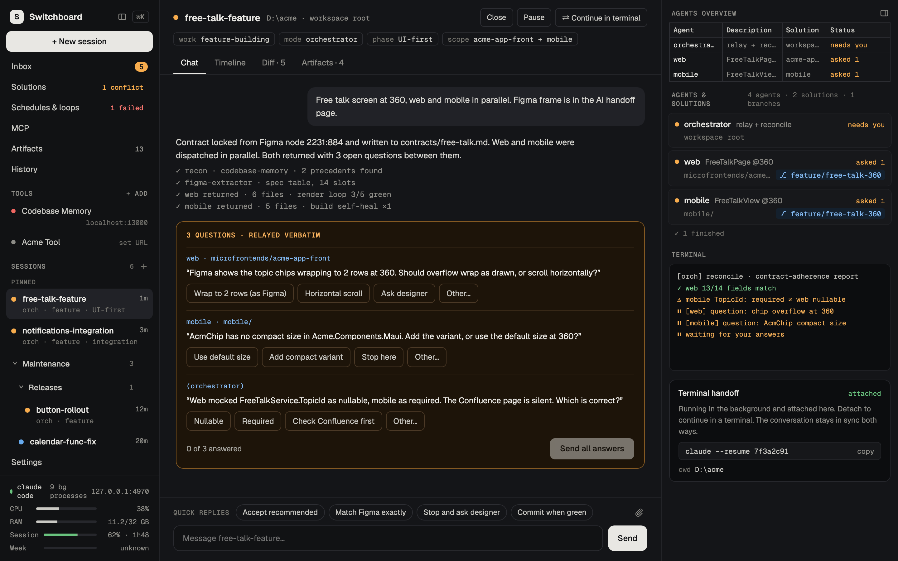
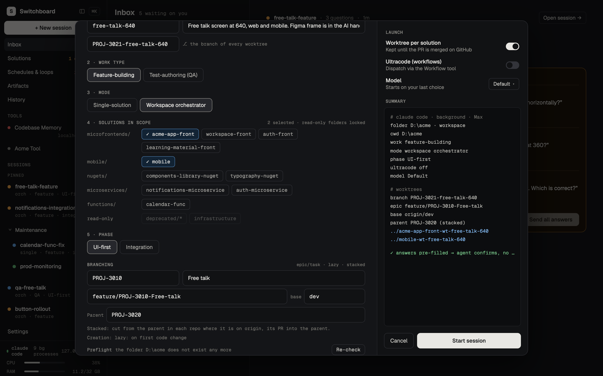
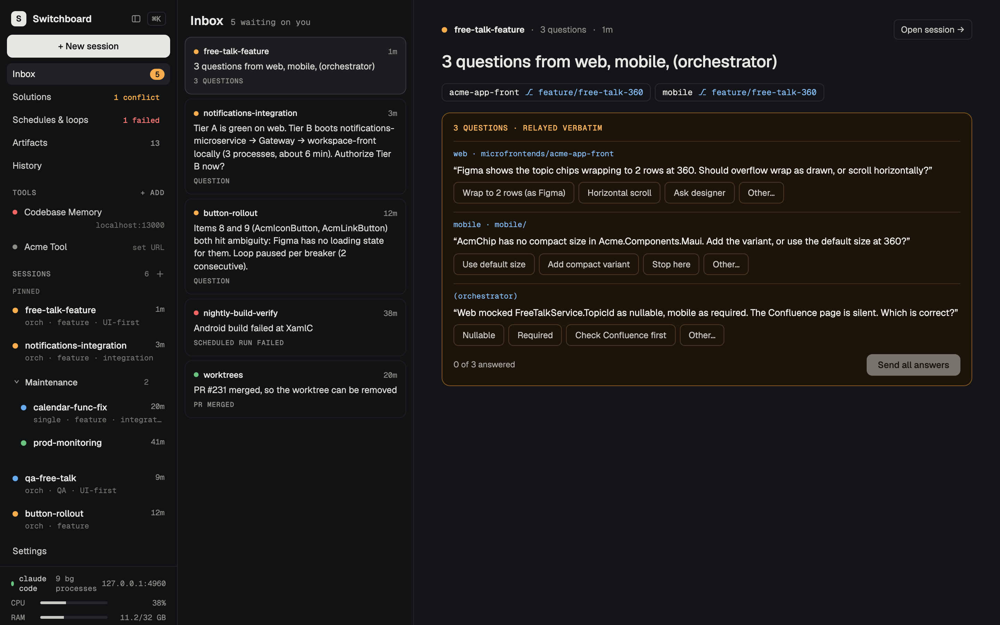
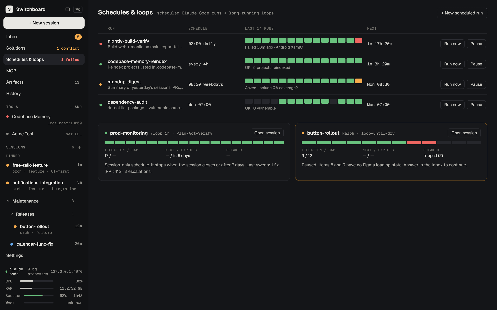
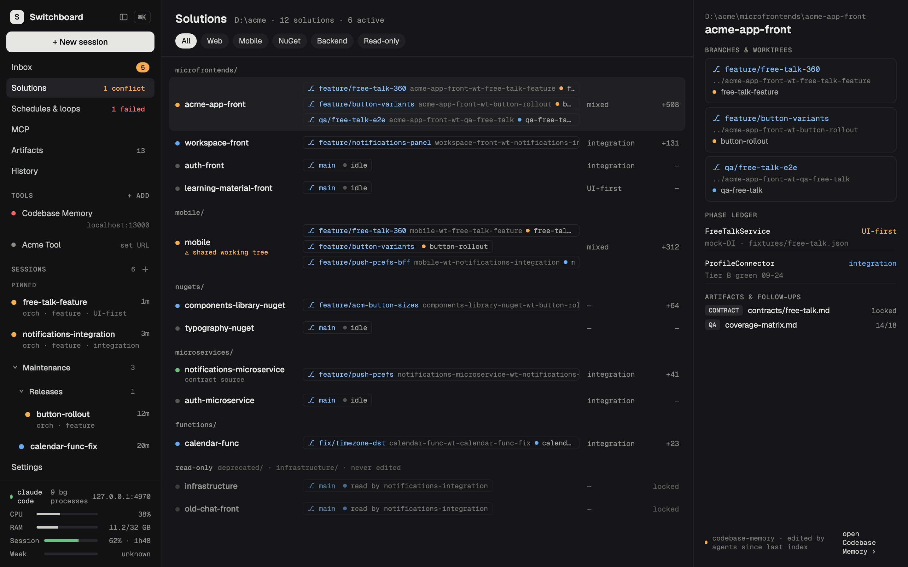
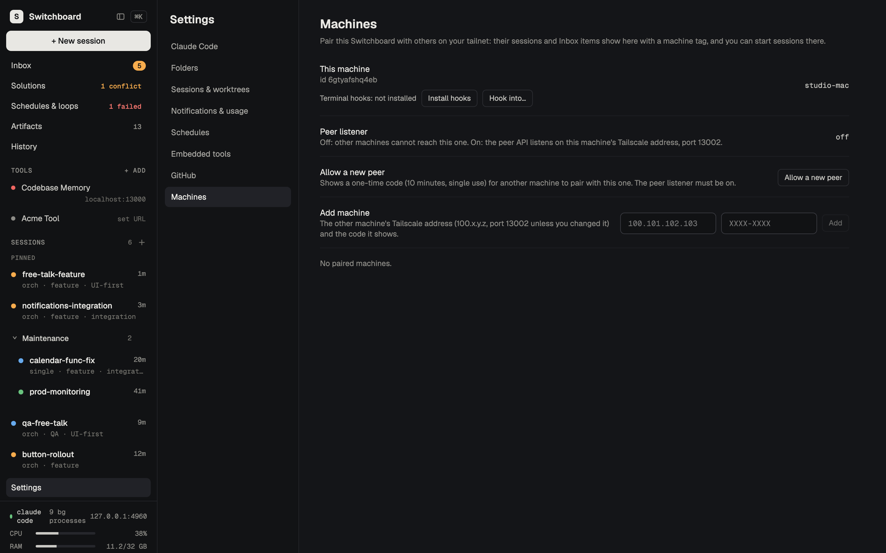

# Switchboard

<a href="https://www.paypal.com/donate/?hosted_button_id=S9P6C8KLXWRZN" target="_blank" rel="noopener noreferrer"></a>

Switchboard is a local web app for running many Claude Code sessions at once. From one window you can:

- start sessions in your workspace or repos, each in its own git worktree if you want;
- watch every agent work live, subagents included;
- answer their questions from a single Inbox;
- move sessions between Switchboard and a terminal, and back.

It runs on your machine only (`127.0.0.1`). It drives the unmodified `claude` CLI with your own login.



- [Requirements](#requirements)
- [Install and run](#install-and-run)
- [Updating](#updating)
- [Start at login](#start-at-login)
- [Configuration](#configuration)
- [Features](#features)
- [Security model](#security-model)
- [For developers](#for-developers)
- [Troubleshooting](#troubleshooting)

---

## Requirements

Install these **before** Switchboard:

| What | Needed for | Check |
|---|---|---|
| **Node.js 24 or newer** (with npm), on `PATH` | Switchboard runs its TypeScript directly on Node (type stripping). | `node --version` → `v24.x` or higher |
| **git** | Worktrees, branches and diffs. On Windows, Git for Windows is also what Claude Code needs. | `git --version` |
| **Claude Code CLI** (`claude`), signed in with your **claude.ai subscription** (Pro / Max) | Every session is a real `claude` process. An API key alone is not enough for Remote Control. | `claude --version`, `claude auth status` |
| **A browser**: Chrome (recommended), Edge, Firefox or Safari | The UI. Embedding signed-in sites such as Jira needs Chrome ([Embedded tools](#embedded-tools)). | |
| **GitHub CLI** (`gh`), signed in (optional) | Detects merged pull requests of session worktrees. | `gh auth status` |
| **Tailscale** (optional) | Connecting Switchboards on several machines ([Machines (peers)](#machines-peers)). | `tailscale status` |

<details>
<summary><b>macOS</b>: installing the requirements</summary>

```sh
# Homebrew: https://brew.sh
brew install node git          # check `node --version` is 24 or newer (or use nvm / fnm)
brew install gh                # optional
curl -fsSL https://claude.ai/install.sh | bash   # Claude Code (native installer)
claude                         # run once and sign in with your claude.ai account
```
</details>

<details>
<summary><b>Linux</b>: installing the requirements</summary>

```sh
# Node.js 24 via nvm (https://github.com/nvm-sh/nvm); distro packages are often older
curl -o- https://raw.githubusercontent.com/nvm-sh/nvm/master/install.sh | bash
exec $SHELL -l && nvm install 24
sudo apt install git           # Debian / Ubuntu; use your distro's package manager otherwise
# optional: gh (https://github.com/cli/cli/blob/trunk/docs/install_linux.md)
curl -fsSL https://claude.ai/install.sh | bash   # Claude Code (native installer)
claude                         # run once and sign in with your claude.ai account
```

Start at login uses a **systemd user service** (most desktop distributions).
</details>

<details>
<summary><b>Windows 10 / 11</b>: installing the requirements</summary>

In **PowerShell**:

```powershell
winget install OpenJS.NodeJS.LTS   # then check `node --version` is 24 or newer
winget install Git.Git             # Git for Windows (Claude Code needs it too)
winget install GitHub.cli          # optional
irm https://claude.ai/install.ps1 | iex   # Claude Code (native installer: claude.exe)
claude                             # run once and sign in with your claude.ai account
```

Open a **new** terminal afterwards so the updated `PATH` is picked up. Use the native installer for Claude Code: an npm install creates `claude.cmd`, which Switchboard can't start without a shell (then set `SWITCHBOARD_CLAUDE_BIN`, see [Configuration](#configuration)). `tar` and `curl` come with Windows 10 and 11.
</details>

## Install and run

The recommended way is a **release**: the UI comes pre-built, and Switchboard [updates itself](#updating). Pick a folder for it. The examples use `~/Applications/Switchboard` (macOS), `~/.local/opt/switchboard` (Linux) and `%LOCALAPPDATA%\Programs\Switchboard` (Windows). Replace `1.1.1` with the [latest release](https://github.com/MarcinGadomski94/switchboard/releases/latest).

### macOS and Linux

```sh
V=1.1.1
DIR=~/Applications/Switchboard            # Linux: ~/.local/opt/switchboard
mkdir -p "$DIR" && cd "$DIR"
curl -LO https://github.com/MarcinGadomski94/switchboard/releases/download/v$V/switchboard-$V.tar.gz
curl -LO https://github.com/MarcinGadomski94/switchboard/releases/download/v$V/switchboard-$V.tar.gz.sha256
shasum -a 256 -c switchboard-$V.tar.gz.sha256   # Linux: sha256sum -c …
tar -xzf switchboard-$V.tar.gz && cd switchboard-$V
npm ci --omit=dev                         # runtime dependencies only
npm run service:install -- --start        # start now and at every sign-in (launchd / systemd --user)
```

Prefer not to install a service? Run `npm start` in that folder instead, and keep the terminal open.

### Windows

In **PowerShell**:

```powershell
$V = "1.1.1"
$Dir = "$env:LOCALAPPDATA\Programs\Switchboard"
New-Item -ItemType Directory -Force $Dir | Out-Null; Set-Location $Dir
curl.exe -LO "https://github.com/MarcinGadomski94/switchboard/releases/download/v$V/switchboard-$V.tar.gz"
curl.exe -LO "https://github.com/MarcinGadomski94/switchboard/releases/download/v$V/switchboard-$V.tar.gz.sha256"
# the two hashes must be the same:
(Get-FileHash "switchboard-$V.tar.gz" -Algorithm SHA256).Hash.ToLower(); (Get-Content "switchboard-$V.tar.gz.sha256").Split(" ")[0]
tar -xzf "switchboard-$V.tar.gz"; Set-Location "switchboard-$V"
npm ci --omit=dev
npm run service:install -- --start    # a Task Scheduler task that starts Switchboard at every sign-in
```

The task runs `node.exe` in a console window; **closing that window stops Switchboard** (minimise it instead). Or run `npm start` in that folder by hand.

### Open it

Open **http://127.0.0.1:13001** by typing it or from a bookmark. That first page load gives your browser its access cookie ([Security model](#security-model)).

The first time, a **setup wizard** opens:
1. It checks the `claude` CLI and its sign-in (plus `gh`).
2. It adds your first **folder**: a workspace (a folder with a router `AGENTS.md`) or a git repository.
3. It scans that folder's solutions.
4. It sets up notifications.

You can skip it and do all of this later in Settings. Your data (the database, the access token, logs) lives in the per-user data folder: `~/Library/Application Support/Switchboard` (macOS), `~/.local/share/switchboard` (Linux), `%LOCALAPPDATA%\Switchboard` (Windows).

### From source (development)

A git checkout builds the UI itself and is only **told** about new releases, not updated:

```sh
git clone https://github.com/MarcinGadomski94/switchboard.git && cd switchboard
npm ci          # exact, pinned dependencies (including the build tools)
npm run build   # builds the UI into dist/web
npm start       # serves http://127.0.0.1:13001
```

Run it on another port next to a release install with `SWITCHBOARD_PORT=13005 npm start` (PowerShell: `$env:SWITCHBOARD_PORT=13005; npm start`).

## Updating

Switchboard checks its [GitHub releases](https://github.com/MarcinGadomski94/switchboard/releases) on start and every hour (Settings → **Updates** → **Check for updates** checks now). A newer release shows a banner and an Inbox item; **What's new** shows its release notes.

**A release install** (unpacked from a `switchboard-<version>.tar.gz`) updates itself: **Update** downloads the release, checks its SHA-256 checksum, unpacks it next to the running one (`<data folder>/versions/<version>`), runs `npm ci --omit=dev` there and switches to it. When Switchboard runs as the login service ([Start at login](#start-at-login)), the service restarts it into the new version and live sessions resume; started by hand with `npm start`, it tells you to restart it from the new folder (`cd "<data folder>/versions/<version>" && npm start`). Your database and settings stay where they are; migrations run on the new version's first start. The previous version stays for a rollback: `npm run service:install -- --start` in its folder. Details: [`docs/updates.md`](docs/updates.md).

**A git checkout** is only told about new releases (with the commands). After pulling new code:

```sh
npm ci           # only when package-lock.json changed
npm run build    # the UI is served from dist/web, so rebuild it
# then restart Switchboard (stop npm start / the service and start it again)
```

Database migrations run by themselves on start. Sessions that were live when Switchboard stopped are resumed after the restart. `SWITCHBOARD_UPDATES=off` switches the checks off.

**Making a release** (maintainers): bump the version, then `npm run release:package` writes `dist/release/switchboard-<version>.tar.gz` and its `.sha256`; publish both with `gh release create v<version> … --notes-file <notes>` ([`docs/updates.md`](docs/updates.md) → *Release packages*).

## Start at login

**Settings → Claude Code → Start at login**, or from a terminal:

```sh
npm run service:install -- --dry-run   # shows every file and command, changes nothing
npm run service:install                # launchd (macOS) / systemd --user (Linux) / Task Scheduler (Windows)
npm run service:uninstall
```

Run these in the folder you start Switchboard from: the service starts `node src/server/main.ts` there. A release install is ready as it is; a git checkout needs `npm run build` first. `--start` also starts it right away. It starts Switchboard at sign-in and is not restarted after a crash (start it again with `npm run service:install -- --start`). Details: [`docs/service.md`](docs/service.md).

## Configuration

Settings are environment variables, read at start. An invalid value makes `npm start` exit with a message.

| Variable | Default | What |
|---|---|---|
| `SWITCHBOARD_PORT` | `13001` | The port; the address is always `127.0.0.1`. |
| `SWITCHBOARD_DATA_DIR` | per-user app data (`~/Library/Application Support/Switchboard` on macOS) | The database (`switchboard.db`) and the access token (`sb_token`). |
| `SWITCHBOARD_CLAUDE_BIN` | `claude` | The Claude Code CLI; a JSON array is used as an argv prefix. |
| `SWITCHBOARD_GH_BIN` | `gh` | The GitHub CLI. |
| `SWITCHBOARD_SETUP_WIZARD` | on | `off` stops the wizard from opening by itself. |
| `SWITCHBOARD_UPDATES` | on | `off` stops the hourly check for new releases (and updating). |
| `SWITCHBOARD_UPDATE_REPO` | `MarcinGadomski94/switchboard` | The GitHub repository whose releases are checked (forks). |
| `SWITCHBOARD_CLAUDE_EXTRA_ARGS` | none | Dev only: a JSON array of extra flags for every `claude` spawn. |
| `SWITCHBOARD_TAILSCALE_BIN` | `tailscale` | The Tailscale CLI; `tailscale ip -4` gives the address of the optional peer listener (Machines). |

Everything else, such as saved folders, tools, notification and usage settings, lives in the database and is edited in **Settings**. The full list, with test-only variables, is in [`docs/configuration.md`](docs/configuration.md).

---

## Features

<table>
  <tr>
    <td width="50%"><br><sub>New session: solutions, worktrees and epic/task branching</sub></td>
    <td width="50%"><br><sub>Inbox: every agent question in one place</sub></td>
  </tr>
  <tr>
    <td width="50%"><br><sub>Schedules &amp; loops</sub></td>
    <td width="50%"><br><sub>Solutions, and a sidebar with pins and folders</sub></td>
  </tr>
  <tr>
    <td width="50%"><br><sub>Settings → Machines: pair other Switchboards on your tailnet</sub></td>
    <td width="50%"></td>
  </tr>
</table>

Screenshots come from the demo seed (`docs/demo.md`); `npm run screenshots` retakes them.

### Folders
There is no single workspace root. You save **folders** in **Settings → Folders**, and each session, scan and schedule names the one it works in:
- A **workspace** (router `AGENTS.md`) gets the router's session-start questions answered up front in the Full New-session form (the Simple form leaves them to the agent).
- A **git repo** is a single solution.

A folder can have a custom name. [`docs/folders.md`](docs/folders.md)

### New session
- **Simple / Full:** a switch at the top of the dialog. **Simple** (the default) asks only for the folder, the message, an optional title (taken from the message when empty), the model and whether to work in its own git worktree (git repo folders; the branch is derived from the title, e.g. `sb/fix-login`, and can be edited). **Full** is the form below. The dialog remembers the last one used, and what you typed carries over when you switch.
- **Title:** free text, e.g. "JIRA Ticket handling". A kebab-case short name is derived from it for the branch and worktree folder.
- **Task:** what the agent should do.
- **Session-start answers:** work type, mode, solutions in scope, phase, mobile coordination, ultracode.
- **No solutions picked:** you can leave the solutions empty and let the agent decide. It creates the worktrees it needs, Switchboard adopts them, and the session's solutions fill in from what the agent touches.
- **Model and effort:** chosen in the form; the next session starts on your last choice.
- **Worktrees:** each session can work in its own git worktree. The **branch must be named after its ticket**, e.g. `PROJ-0001-short-description`, and it is pre-filled when the title starts with a ticket key.
- **Continuing existing work:**
  - **pick a terminal conversation** to move it into Switchboard;
  - **"From a remote session"**: paste a claude.ai/code session URL to continue a cloud or Remote Control session as a local copy.
- **Branching:** with an epic (key + summary), task branches are cut from `feature/<EPIC-KEY>-<Summary>`, which is itself cut from `origin/dev`. Without an epic (bug fixes), they are cut from `origin/master` after a fetch. Branches are created and pushed lazily, only in the repos the agent changes. A preflight table shows, per repo, the base, the epic, the task branch, the cut point and the PR target before you start. An existing task branch is reused.
- **Stacked tasks:** type a **Parent** (a task key such as `PROJ-3013`, or a branch name; it is pre-filled when the task says "create it from PROJ-3013") to cut the task from that unmerged task branch instead of the epic, per repo where the parent exists, with its PR into the parent. The preflight shows each repo's resolved base, PR target and the parent PR's status. When the parent PR merges, the Inbox tells you and the agent is asked to retarget its PR and rebase (it asks you before force-pushing); a parent closed without merging raises an Inbox item.
- **Machine:** with a paired machine (see *Machines (peers)*), start the session on that machine instead, with its folders and models.

[`docs/new-session.md`](docs/new-session.md) · [`docs/worktrees.md`](docs/worktrees.md)

### The session view
**Chat**
- **Formatting:** agent and developer messages render as Markdown, with syntax colors and clickable links.
- **Composer:** **Enter** sends, **Shift+Enter** adds a line.
- **Live activity:** "Pondering… 1m 23s", "● Bash: npm test 0:42".
- **Background waits:** a GitHub Actions run, a build, a subagent, a timer, a background workflow or any other task the CLI reports shows as working ("⏳ Waiting for GitHub Actions: …", "⏳ Running a workflow: …") instead of looking idle.
- **Queued messages:** a message you send while the agent is busy shows a clock until the agent takes it up. A message to a paused session resumes it.
- **Stop:** while the agent works, **Send** becomes **■ Stop**, and **Esc** does the same (an open popup takes Esc first). It stops the current turn only, like Ctrl+C in the terminal: the session stays ready for your next message. Messages still queued come back into the message field so you can edit them. When only background tasks are left, **Stop background tasks** stops them after you confirm.
- **Context bar:** a thin bar above the quick replies shows how full the session's context window is (`Context 62% · 124k / 200k`), green, then yellow from 60 % and red from 80 %. After the CLI compacts the conversation it resets and reads "compacted 14:05" until the next turn. A tick marks where the CLI will compact by itself ("Auto-compact at 84%" on hover).
- **Questions:** the agent's questions appear as cards in the chat. Besides the offered answers, **Other…** lets you answer in your own words.

**Header**
- **Rename:** click the title.
- **Model and effort picker:** changes the running session from its next turn.
- **Close:** the session leaves the sidebar and can be reopened from History.
- **Remote:** makes the session reachable from your phone or claude.ai.
- **Pause / Resume.**
- **Continue in terminal:** hands the session over to a terminal; **Attach here** takes it back.

**Right panel**
- **Agent overview:** a table of Agent · Description · Solution · Status for every agent. The newest status table the agent printed appears under it as a readable table ("as printed" shows the original).
- **Agent cards** with each agent's current action. Finished subagents fold into a "✓ N finished" line, which you click to show them again.
- **Workflow agents:** the agents a Workflow runs (orchestrator mode) are listed too: a row per workflow (its progress, e.g. "3/7 done · phase Review") with its agents under it, cards for the running ones, and "⏳ Running a workflow: … · 3/7 agents done · phase Review" in the chat. Click one to open its chat. A workflow with many agents shows six cards and a "+N more" line that opens the rest. A stopped or failed run has **Resume run**, which asks the agent to resume it. They survive a reload and a restart (read from Claude Code's own files).
- **The terminal tail** and the **handoff** command.

**Subagent chats**
- **Open one:** click a subagent's **Agent** step in the chat, its card, or its overview row (a workflow agent's too). You see its own conversation: the brief from the main agent (or the workflow), its messages and tool steps, and its result.
- **Get back:** **← Main chat**, **Esc** or the browser's Back returns you to the same spot.
- **No composer:** subagents take no messages; reply in the main chat.

**Tabs:** Timeline, Diff (per worktree), Artifacts.

**Switching sessions:** a session you visited recently opens instantly; one still loading shows placeholders instead of a blank or stale view.

**Organize the sidebar:** pin sessions (a row's **⋯** → **Pin**) into a **Pinned** group at the top, and group them in **folders** (the **+** next to SESSIONS) and **subfolders** (a folder's **⋯** → **New subfolder**, up to five levels): drag sessions into and out of folders, drag a folder onto another to nest it, drag to re-order pinned sessions, folders and the sessions inside a folder, collapse a folder to its name and count. Everything else stays sorted newest first. The ⋯ menus (Move to folder ▸, Move up / down, Rename, Delete) do the same from the keyboard. The layout is kept by Switchboard, the same in every tab and after a restart. [`docs/sidebar.md`](docs/sidebar.md)

**More room:** slide the sidebar (**⌘B**) or the right panel (**⌥⌘B**) out with its small hide button; a slim handle at the window's edge brings it back. The choice is remembered across reloads and restarts.

[`docs/chat.md`](docs/chat.md) · [`docs/session-panel.md`](docs/session-panel.md) · [`docs/model-effort.md`](docs/model-effort.md) · [`docs/panes.md`](docs/panes.md)

### Inbox and notifications
- Every question batch and permission request from every session lands in the **Inbox**. Answer it there or in the session's chat.
- A new question also raises a **toast**, a chime and an OS notification (when allowed).
- A notification closes by itself once you open that session or the question is answered.
- **System items** also appear there: a pull request was merged and its worktree can be removed; a scheduled run failed.

[`docs/inbox.md`](docs/inbox.md) · [`docs/notifications.md`](docs/notifications.md)

### Solutions
- Every solution of a folder, grouped the way the router groups them.
- Each one's live branches and worktrees, phase ledger and artifacts.
- A **conflict card** when two sessions work in the same checkout. **Move … to worktree** isolates one of them onto a ticket branch.

[`docs/solutions.md`](docs/solutions.md)

### Schedules and loops
- **Cron schedules:** start sessions from templates.
- **Loop cards:** show observed `/loop`, `ScheduleWakeup`, `CronCreate` and Workflow runs: iteration, next firing, expiry.

[`docs/schedules.md`](docs/schedules.md)

### History
- Every session, and every **terminal conversation** from `~/.claude/projects`.
- **Continue in Switchboard:** moves a terminal conversation in as the same conversation.
- **Closed** sessions can be **reopened**.
- Local copies of remote sessions are tagged.

### Remote
- **Remote** (header toggle): puts a Switchboard session on claude.ai and the Claude mobile app through Claude's Remote Control. It shows a link and a QR code, and the link stays the same across pause and resume. Questions answered on the phone close in Switchboard.
- **From a remote session** (New session): pulls a cloud or other-machine session into a fresh worktree as a **one-way local copy**.
- **Not possible yet:** listing your cloud sessions, or attaching live to one. The CLI keeps that switched off for accounts today.

[`docs/remote-control.md`](docs/remote-control.md) · [`docs/spike-remote.md`](docs/spike-remote.md)

### Machines (peers)
Pair Switchboards on your tailnet (a Mac and Windows PCs), in **Settings → Machines**:
- **Peer listener** (off by default): lets paired machines reach this one on its **Tailscale address** only (port 13002). The UI itself stays on 127.0.0.1.
- **Allow a new peer** shows a one-time code (10 minutes, single use); on the other machine, **Add machine** with this machine's Tailscale address and the code. One pairing works both ways; each machine shows the other as online / offline / auth failed / no address, reconnects by itself, and can be renamed or removed (which revokes it on both sides).
- **Remote sessions:** a paired machine's sessions appear in the sidebar with a **machine tag** and open in the normal session view: chat, question cards, queued messages, pause / resume, model and effort, close / reopen, Diff, Artifacts, Timeline, subagent chats. Its questions and permission requests land in your **Inbox** (tagged; toasts and notifications too), and answering here answers there. When the machine is offline its sessions stay listed as **unreachable** (also after a restart of your Switchboard) and readable as last seen, but nothing can be sent or answered until it is back; it keeps running them.
- **Start a session on a peer:** the New-session form's **Machine** row picks the machine; its folders, models and the branching check come from there, and the session runs there.
- **A peer's schedules and loops:** Schedules & loops lists every paired machine's schedules and loops with its tag. Schedules can be created there (the Machine row of **+ New scheduled run**), edited, deleted, run now, paused and resumed from here; they run on that machine. Loops include terminal sessions nobody hooked (read from their transcripts; **Hook into…** opens one). An offline machine's rows stay, with their actions disabled.
- **Hook into a terminal session:** `claude` sessions you started by hand in a terminal (on this machine or a paired one) can be followed from Switchboard. **Install hooks** once per machine (Switchboard adds only its own entries to that machine's `~/.claude/settings.json`, after a backup), then **Hook into…** picks a session: its chat, permission prompts (Allow once / Always allow / Deny with a message), plan approval and question cards work from here, its subagents and their chats show too, and your messages reach it at its next step or wake it when idle (exactly once, at most 3 a minute). Interrupt, slash commands and model changes stay in the terminal. A checklist for the first run on Windows is in `docs/peers.md`.
- **Live activity everywhere:** a hooked session (and any peer's session) shows the same live line as a local one: `Pondering… 1m 23s`, `● Bash: npm test 0:42`, `⏸ Waiting for permission: Bash`, read from its transcript and hooks; `· no activity for 3m` when nothing has moved for 3 minutes, so a stuck turn is visible. A message to a hooked session says what it waits on (e.g. "No hook listening yet — type anything in that terminal once").

[`docs/peers.md`](docs/peers.md)

### Embedded tools
Local web tools open inside Switchboard from the sidebar (**TOOLS**); add them in Settings → Embedded tools. Codebase Memory is built in, including its "reindex n now" strip.

- **Local tools:** go through a small local proxy, so tools that refuse to be framed still open.
- **Signed-in sites** such as Jira: need the **frame helper** browser extension (`tools/frame-helper`), loaded in **Chrome**. It lifts the framing headers only for your saved site tools, and only in Switchboard's tab.
  - **Setting it up:** Settings → Embedded tools → **Frame helper → Set up** (or **Set up frame helper** on the site's page) walks you through it. It opens Chrome's extensions page, reveals the folder in Finder, copies its path, then asks you to reload the tab. The one click only you can make is **Load unpacked**.
- **Safari:** can't do this; those tools open in a new tab.

[`docs/tools.md`](docs/tools.md) · [`docs/frame-helper.md`](docs/frame-helper.md)

### Usage and footer
The sidebar footer shows RAM in use and two **Max usage** bars:
- **Session.** It is colored by pace, updated every minute: green while you're under the elapsed share of the 5-hour window, yellow once you're ahead of it.
- **Week.** It is colored by pace: green while you're under the day's share of the week (14.29% per day from your reset hour), yellow once you're ahead of it.

[`docs/usage.md`](docs/usage.md)

### Restarts and recovery
When Switchboard starts, sessions that were live are resumed with `claude --resume` and told "Switchboard restarted. Continue." Closed sessions stay closed. [`docs/supervisor.md`](docs/supervisor.md)

### Install as an app
Switchboard can run in its own app window with a Dock icon (a PWA):
- **Chrome:** Settings → Claude Code → **Install as app**, or the install icon in the address bar.
- **Safari:** **File → Add to Dock…**.

If the service isn't running, the app window shows "Switchboard isn't running" with **Retry**. Nothing else is cached, so after an update just reload the app.

Opening `localhost:13001` takes you to `127.0.0.1:13001`, so there is one app and one login whichever you type. [`docs/install-app.md`](docs/install-app.md)


---

## Security model
- The server listens on **127.0.0.1 only**. Every request must name `127.0.0.1:<port>` or `localhost:<port>` as its Host (this stops DNS rebinding). A browser Origin must be exactly Switchboard's own.
- Every API call needs the **`sb_token` cookie**. It is `HttpOnly`, `SameSite=Strict`, and only set when you open the page yourself (typed URL, bookmark, reload), never from another site.
- The optional **peer listener** (Machines) is a second socket bound only to the Tailscale address. It serves only the peer API, and every call needs that machine's own pairing token (stored hashed); no page, no settings, no folders, no tools.
- **Terminal hooks** (Machines → Install hooks) call Switchboard only on 127.0.0.1 with a separate hook token (a file only you can read); installing and removing them backs up your `~/.claude/settings.json` first and touches only Switchboard's own entries.
- Child processes are spawned with argument arrays, never through a shell.
- Switchboard never reads or passes on your claude.ai credentials. It only runs the `claude` CLI you signed in to.

[`docs/security.md`](docs/security.md)

---

## For developers

### Stack
- One Node.js project: TypeScript strict, **Fastify**, React + **Vite**.
- Server-Sent Events on `/hub` for live updates.
- Built-in **`node:sqlite`** with plain SQL migrations (`src/server/db/migrations/`).
- Node runs the TypeScript directly, so use erasable syntax only: no `enum`, no `namespace`, no parameter properties.

### Layout
```
src/core/     shared types (api.ts = the API contract), pure derivations and rules
src/server/   Fastify app, supervisor (the claude processes), stores, services, routes
src/web/      React UI (views, shell, modals, chat, right panel)
tools/        fake-claude, fake-gh, fake service manager, the frame helper, dev scripts
tests/        unit and integration (Vitest), e2e + visual oracle (Playwright)
docs/         one doc per area, the decisions log, the handoff spec
.loop/        progress.md (what was built, with test counts), questions.md (assumptions, rulings, known flaky tests)
```

### Scripts
| Script | What |
|---|---|
| `npm run dev` | Rebuilds the UI on change and restarts the server (`node --watch`). No HMR: reload the browser. |
| `npm run typecheck` | `tsc` over the server, web, e2e and service-worker configs. |
| `npm test` | Vitest: unit and integration. |
| `npm run e2e` | Playwright (Chromium, 1440×900) on the real code path, including the visual oracle. |
| `npm run icons` | Re-renders the app icons (`src/web/public/icons/`) from their SVGs with Playwright's Chromium. |

### Tests never call the real `claude` or `gh`
- **`tools/fake-claude`** replays recorded stream-json turns and scenarios. Tokens in a prompt drive it, e.g. `[fake:ask-2q]`, `[fake:say "…"]`, `[fake:background …]`. See [`docs/fake-claude.md`](docs/fake-claude.md).
- **`tools/fake-gh`** stands in for the GitHub CLI.
- Tests start their own server on a **test port** (`SWITCHBOARD_TEST_PORTS`, default 4871–4879; 13001 is refused) with a temporary data folder. The E2E UI is built into `.e2e-dist/web`, so a test run never changes the UI you're running from the same checkout.
- The only real-CLI checks are manual and bounded: Haiku, `--max-turns` ≤ 3, in a gitignored sandbox ([`docs/smoke-real-cli.md`](docs/smoke-real-cli.md)).

### Visual oracle
- Every view is compared with the handoff prototype (`docs/handoff/`) on computed SPEC tokens, box positions (±2 px) and exact copy.
- The pixel diffs are advisory. `SWITCHBOARD_VISUAL_REPORT=1 npm run e2e` writes side-by-sides into `docs/visual/`.
- Deliberate deviations are recorded as developer rulings.

[`docs/visual/README.md`](docs/visual/README.md)

### Demo mode
`SWITCHBOARD_DEMO=1 SWITCHBOARD_DATA_DIR="$(mktemp -d)" SWITCHBOARD_PORT=4871 npm start` loads the prototype's data through the normal API, for screenshots and the visual oracle. [`docs/demo.md`](docs/demo.md)

### How changes are made
- **The spec:** the handoff (`docs/handoff/`) plus [`docs/decisions.md`](docs/decisions.md) (D1…D54). The developer's rulings win where the two differ.
- **The contract:** API changes are additive and noted in `docs/handoff/contracts/local-api.md`.
- **Parallel work:** features are built in git worktrees under `.worktrees/`, each on its own test ports, then merged into `main` with the full suites green.
- **Definition of done:** `npm run typecheck`, `npm test` and `npm run e2e` all green, with docs and the `.loop` notes updated.
- **Commits** stay local; nothing is pushed without the developer's say.

---

## Troubleshooting

| Symptom | Fix |
|---|---|
| The UI looks old after an update | `npm run build`, then restart Switchboard. |
| `401 unauthorized` / blank data | Open `http://127.0.0.1:13001` by typing it (or a bookmark). Links from other sites don't get the cookie. |
| `listen EADDRINUSE … 127.0.0.1:13001` on start | Another Switchboard (or another app) holds the port: stop it, or set `SWITCHBOARD_PORT`. |
| Setup wizard says "Not signed in" | Run `claude` in a terminal and sign in; check `claude auth status`. |
| Remote toggle is disabled | Its tooltip says why. Usually the process isn't live yet, or the CLI isn't signed in with a claude.ai subscription (no `ANTHROPIC_API_KEY` in Switchboard's environment). |
| Jira shows "needs the Switchboard frame helper" | Click **Set up frame helper** and follow the steps ([`docs/frame-helper.md`](docs/frame-helper.md)); after an update press reload on it in `chrome://extensions`. |
| A tool "refuses to load in a frame" in Safari | Expected: Safari can't lift framing headers. Use Open in new tab, or Chrome. |
| A session looks stuck | The chat line shows what it's doing. "⏳ Waiting for …" means a background task is still running. |
